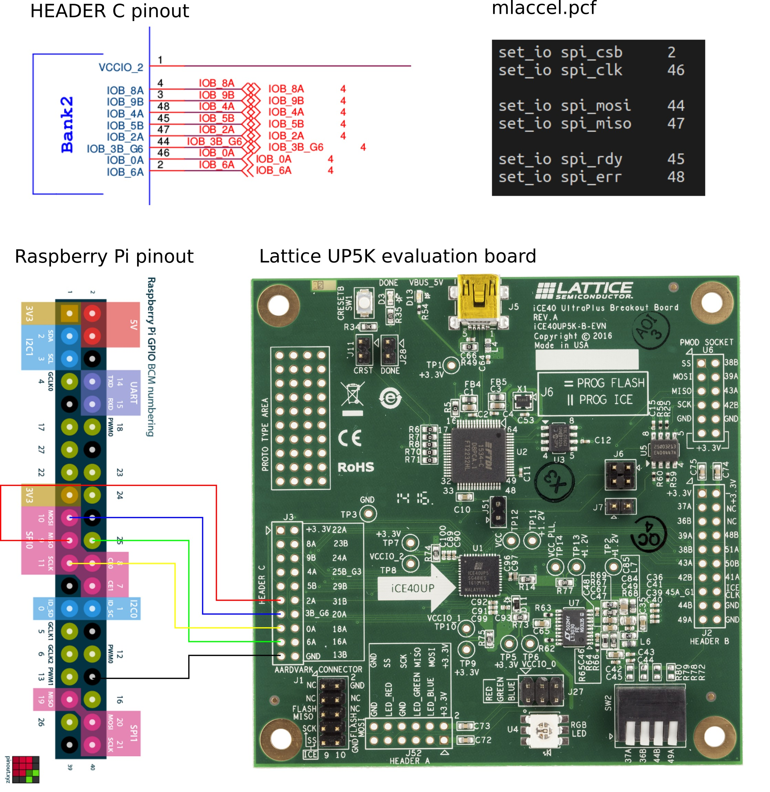

# Raspberry Pi Support

## Build and program MARLANN with SPI support

    cd demo
    make prog_marlann SPI_TYPE=SPI

## Raspberry Pi setup

Enable spi with raspi-config:

* spidev for spi comms

Install Python modules spidev and RPi.GPIO:

* sudo apt-get install python-pip
* sudo pip install spidev
* sudo pip install RPi.GPIO

Connect the Pi's SPI pins to the pins defined in the [UP5k dev board's pcf](../demo/marlann_spi.pcf).

## Run the MARLANN testbench with Python

Run the test:

    python spi_test.py

## Camera SPI Demo

This demo will eventually stream video to the mlaccel core over SPI. For now it just
captures frames and sends the raw data over SPI to an imaginary receiver.

Install opencv the easy way:

    sudo apt-get update
    sudo apt-get install python-opencv

Install Python modules picamera and spidev:

    sudo pip install "picamera[array]"
    sudo pip install spidev

Enable interfaces with raspi-config:

* enable camera for camera module
* spidev for spi comms

Now [cam_to_spi.py](cam_to_spi.py) should:

* read a frame from the camera
* resize according to the resolution set by export_resolution
* send the frame row by row over SPI
